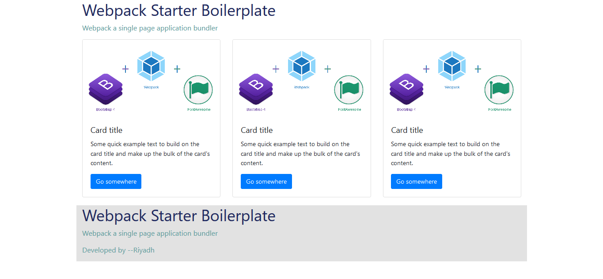

# Webpack Starter boilerplate   
Simple webpack boilerplate with bootstrap, webpack html plugin, file loader, Webpack Dev Server etc   

Installation :    
Clone the projects   
   
   git clone   

 Run the project    

 npm start for develpoment mode   

 npm run build for production    

Output :   

   

 Find me on Facebook  : [ My Facebook profile link](https://www.facebook.com/morshed.riyad) \
 Find me on  Linkedin  : [My Linkedin profile  link](https://www.linkedin.com/in/monjur-morshed-riyadh-6aaba465/)  \
 Email me : riyadhahmed777@gmail.com